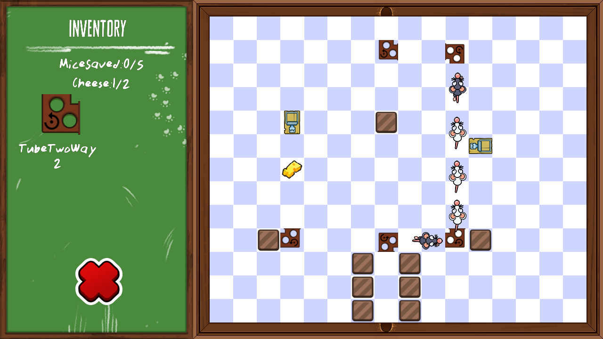

**Nibbled to Bits** is a puzzle game about helping some brave mice navigate a maze filled with treacherous traps in the pursuit of cheese.

It's a project I worked on by myself to solidify my understanding of C++ during my Games Programming apprenticeship in 2023. It's by no means polished but I learnt a lot while making it, particularly about codebase structure.

It uses [PlayBuffer](https://github.com/sumo-digital-academy/playbuffer) which is an excellent framework for learning C++.

### Controls
* Right-click to rotate blocks
* Left-click to drag inventory objects
* Mouse and left-click to fire tank - pick up ammunition (seeds/fruit) to fire and destroy blocks
* Space to skip flavour text
* Home to turn on/off debug mode
* N to skip level
